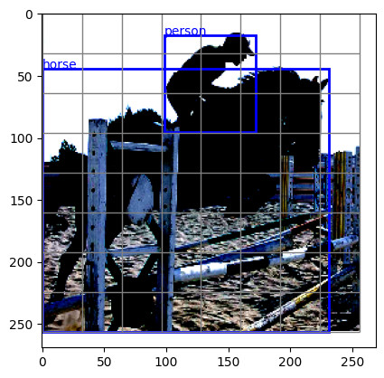

# objdetect
Lightweight and versatile one-stage object detection framework.

## Introduction

I am a post-doc at FEUP (University of Porto) working on perception for autonomous driving ([THEIA project](https://noticias.up.pt/u-porto-bosch-projeto-de-investigacao-28-milhoes-de-euros/)). I developed this one-stage object detection framework because existing frameworks, such as [detectron2](https://github.com/facebookresearch/detectron2), are either for two-stage models or are not versatile and simple enough to adapt for new models. At the very least, I hope this package is educational for someone learning object detection. Contact: [Ricardo Cruz](mailto:rpcruz@fe.up.pt).

Functionality:
* Grid transformations
* Data loaders, data augmentation
* Support for anchors and multiple grids
* Utilities such as non-maximum suppression, plotting, extra losses, evaluation metrics

## Install

```
pip3 install git+https://github.com/rpmcruz/objdetect.git
```

## API

The package is divided into the following components:

* [`anchors`](http://htmlpreview.github.io/?https://github.com/rpmcruz/objdetect/blob/main/html/anchors.html): Utilities to create and filter objects based on filters.
* [`aug`](http://htmlpreview.github.io/?https://github.com/rpmcruz/objdetect/blob/main/html/aug.html): Some data augmentation routines.
* [`data`](http://htmlpreview.github.io/?https://github.com/rpmcruz/objdetect/blob/main/html/data.html): Toy datasets.
* [`grid`](http://htmlpreview.github.io/?https://github.com/rpmcruz/objdetect/blob/main/html/grid.html): Bounding box <=> grid conversion functions.
* [`losses`](http://htmlpreview.github.io/?https://github.com/rpmcruz/objdetect/blob/main/html/losses.html): Extra losses for object detection.
* [`metrics`](http://htmlpreview.github.io/?https://github.com/rpmcruz/objdetect/blob/main/html/metrics.html): The common AP/Precision-Recall metrics.
* [`plot`](http://htmlpreview.github.io/?https://github.com/rpmcruz/objdetect/blob/main/html/plot.html): Common plotting methods.
* [`post`](http://htmlpreview.github.io/?https://github.com/rpmcruz/objdetect/blob/main/html/post.html): Post-processing algorithms, such as non-maximum suppression.

## Getting Started

A notebook example is provided in the `src` folder which provides boiler-plate code to get you started. Following the PyTorch tradition, this package does not try to do too much behind the scenes.

```python
import objdetect as od
```

**Augmentation:** Some data augmentation routines for object detection are available. These are mainly provided for educational purposes and might be removed in the future. We recommend you use [Albumentations](https://albumentations.ai/), which work similarly to ours.

```python
transformations = od.aug.Compose([
    od.aug.Resize(int(256*1.1), int(256*1.1)),
    od.aug.RandomCrop(256, 256),
    od.aug.RandomHflip(),
    od.aug.RandomBrightnessContrast(0.1, 0.1),
    od.aug.ImageNetNormalize(),
])
```

**Data:** Some data loaders are provided: Pascal VOC, Coco, KITTI.

```python
ds = od.data.VOCDetection('data', 'train', transformations, download=True)
```

Each sample is a dictionary composed of at least: image, bboxes and classes.

```python
d = ds[0]
print(d.keys())
```

```
dict_keys(['image', 'bboxes', 'classes'])
```

**Plot:** We provide some plotting routines for convenience.

```python
od.plot.image(d['image'])
od.plot.grid_lines(d['image'], 8, 8)
od.plot.bboxes(d['image'], d['bboxes'])
od.plot.classes(d['image'], d['bboxes'], d['classes'], ds.labels)
od.plot.show()
```



Naturally, the number of bounding boxes varies for each image, therefore they cannot be turned into tensors, so we need to specify a `collate` function for how the batches should be created.

```python
tr = torch.utils.data.DataLoader(ds, 16, True, collate_fn=od.data.collate_fn)
```

**Model:** We used to provide method to create models and training loops. However, as commonly done in PyTorch, it is better if you setup your model and create your own training loop. Here we provide some boiler-plate code of how to do so. We will create the following model.

Notice that, like the object detection models that come with torchvision (see e.g. [FCOS](https://pytorch.org/vision/stable/models/generated/torchvision.models.detection.fcos_resnet50_fpn.html#torchvision.models.detection.fcos_resnet50_fpn)), the behavior of our code changes if in `train` or `eval` mode, but we don't do exactly what they do. In `train` mode, we return the *unprocessed* scores/classes/bboxes grids. In `eval` mode, we return the *processed* classes/bboxes in the form of a list.


```python
class MyModel(torch.nn.Module):
    def __init__(self):
        super().__init__()
        self.backbone = torchvision.models.vgg16(weights='DEFAULT').features
        self.scores = torch.nn.Conv2d(512, 1, 1)
        self.classes = torch.nn.Conv2d(512, 20, 1)
        self.bboxes = torch.nn.Conv2d(512, 4, 1)

    def forward(self, x):
        x = self.backbone(x)
        scores = self.scores(x)
        classes = self.classes(x)
        bboxes = self.bboxes(x)
        if not self.training:
            # when in evaluation mode, convert the output grid into a list of bboxes/classes
            scores = torch.sigmoid(scores)
            hasobjs = scores >= 0.5
            scores = inv_scores(hasobjs, scores)
            bboxes = od.grid.inv_offset_logsize_bboxes(hasobjs, bboxes)
            classes = od.grid.inv_classes(hasobjs, classes)
            bboxes, classes = od.post.NMS(probs, bboxes, classes)
            return bboxes, classes
        return scores, bboxes, classes
```

**Training:** Again, we no longer provide routines for the training loop. It is better if you create your own. Here is some boiler-plate code.

```python
model = MyModel().to(device)
scores_loss = torch.nn.BCEWithLogitsLoss()
bboxes_loss = torch.nn.MSELoss(reduction='none')
classes_loss = torch.nn.CrossEntropyLoss(reduction='none')
optimizer = torch.optim.Adam(model.parameters())
epochs = 10

model.train()
for epoch in range(epochs):
    avg_loss = 0
    for imgs, targets in tqdm(tr, leave=False):
        imgs = imgs.to(device)
        preds_scores, preds_bboxes, preds_classes = model(imgs)

        slices = od.grid.slices_center_locations(8, 8, targets['bboxes'])
        scores = od.grid.scores(8, 8, slices).to(device)
        bboxes = od.grid.offset_logsize_bboxes(8, 8, slices, targets['bboxes']).to(device)
        classes = od.grid.classes(8, 8, slices, targets['classes']).to(device)

        loss_value = \
            scores_loss(preds_scores, scores) + \
            (scores * bboxes_loss(preds_bboxes, bboxes)).mean() + \
            (scores * classes_loss(preds_classes, classes)).mean()
        optimizer.zero_grad()
        loss_value.backward()
        optimizer.step()
        avg_loss += float(loss_value) / len(tr)
    print(f'Epoch {epoch+1}/{epochs} - Avg loss: {avg_loss}')
```

**Grid:** When working with one-stage detection, we first need to represent the objects inside a given image as a grid (or multiple grids). You can do so during the data augmentation pipeline (which takes advantage of the DataLoader parallelization), but it might be simpler to do so inside the training loop (see the code above).

Notice that slicing and how bounding boxes are setup changes greatly between models. Models like [YOLOv3](https://arxiv.org/abs/1804.02767) use a grid where each object occupies a single location (`slices_center_locations()`), and the bounding box would specify the center offset and log-size (`offset_logsize_bboxes()`). Other models such as [FCOS](https://arxiv.org/abs/1904.01355) place each object on all locations it touches (`slices_all_locations()`), and the bounding box would be set relative (`inv_offset_logsize_bboxes()`).

**Evaluation:** For evaluation purposes, we provide several metrics: the precision-recall curve, AP, mAP. These are mainly provided for educational purposes. You may want to consider using the [TorchMetrics package](https://torchmetrics.readthedocs.io/en/stable/).

## Citation

```bib
@misc{objdetect,
  author = {Ricardo Cruz},
  title = {{ObjDetect package}},
  howpublished = {\url{https://github.com/rpmcruz/objdetect}},
  year = {2022}
}
```
