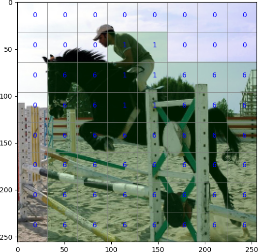
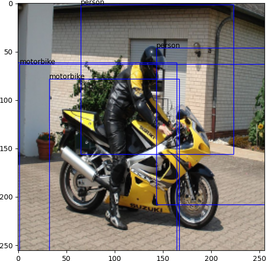
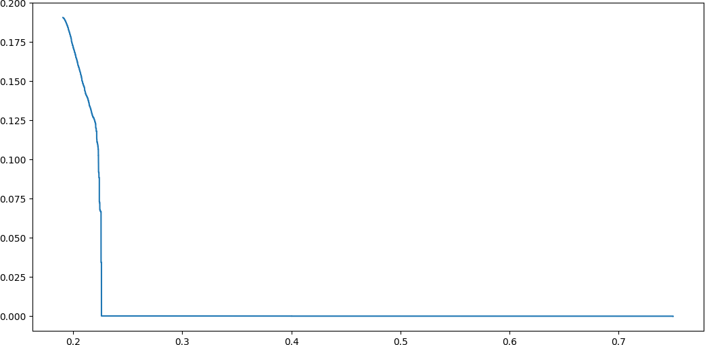

# objdetect
Lightweight and versatile one-stage object detection framework.

## Introduction

I am a post-doc at FEUP (University of Porto) working on perception for autonomous driving ([THEIA project](https://noticias.up.pt/u-porto-bosch-projeto-de-investigacao-28-milhoes-de-euros/)). I developed this one-stage object detection framework because existing frameworks, such as [detectron2](https://github.com/facebookresearch/detectron2), are either for two-stage models or are not versatile and simple enough to adapt for new models. At the very least, I hope this package is educational for someone learning object detection.

Let me know if you have success or need help using this package for your project. -- [Ricardo Cruz](mailto:rpcruz@fe.up.pt)

## Install

```
pip3 install git+https://github.com/rpmcruz/objdetect.git
```

## API

The package is divided into the following components:

* [`aug`](http://htmlpreview.github.io/?https://github.com/rpmcruz/objdetect/blob/main/html/aug.html): Some data augmentation routines.
* [`data`](http://htmlpreview.github.io/?https://github.com/rpmcruz/objdetect/blob/main/html/data.html): Toy datasets.
* [`grid`](http://htmlpreview.github.io/?https://github.com/rpmcruz/objdetect/blob/main/html/grid.html): Bounding box <=> grid conversion functions.
* [`inv_grid`](http://htmlpreview.github.io/?https://github.com/rpmcruz/objdetect/blob/main/html/inv_grid.html): Inversions for the `grid` methods.
* [`loop`](http://htmlpreview.github.io/?https://github.com/rpmcruz/objdetect/blob/main/html/loop.html): Convenience functions to train and evaluate the model.
* [`losses`](http://htmlpreview.github.io/?https://github.com/rpmcruz/objdetect/blob/main/html/losses.html): Extra losses for object detection.
* [`metrics`](http://htmlpreview.github.io/?https://github.com/rpmcruz/objdetect/blob/main/html/metrics.html): The common AP/Precision-Recall metrics.
* [`models`](http://htmlpreview.github.io/?https://github.com/rpmcruz/objdetect/blob/main/html/models.html): Backbone example and several common heads.
* [`plot`](http://htmlpreview.github.io/?https://github.com/rpmcruz/objdetect/blob/main/html/plot.html): Common plotting methods.
* [`post`](http://htmlpreview.github.io/?https://github.com/rpmcruz/objdetect/blob/main/html/post.html): Post-processing algorithms, such as non-maximum suppression.

## Getting Started

This package relies heavily on two things: (i) dictionaries to bind everything together (grid/model/loss/etc), and (ii) function closures to decompose functionality into smaller parts.

**Grid:** When working with one-stage detection, we first need to represent the objects inside a given image as a grid (or multiple grids). We recommend doing it as the final step of the data augmentation pipeline. Doing it this way takes advantage of DataLoader parallelization. For the transformation pipeline, we provide methods that function similarly to the [albumentations package](https://albumentations.ai/), and, in fact, should be compatible with it so that you may use albumentations if you wish.

Let us build three grids specifying whether an object is occupying the given location (`hasobjs`), the classes grid (`classes`), and the bounding boxes information grid (`bboxes`).

```python
import objdetect as od

grid_size = (8, 8)
# if any objects should be filtered (useful for multiple grids)
filter_function = None
# which locations are occupied by the object
slicing_function = od.grid.SliceAcrossCeilBbox()
create_grids = {
    'hasobjs': od.grid.NewHasObj(),
    'classes': od.grid.NewClasses(),
    'bboxes': od.grid.NewBboxes()
}
map_grids = {
    'hasobjs': od.grid.SetHasObj(),
    'classes': od.grid.SetClasses(),
    'bboxes': od.grid.SetRelBboxes()
}

transform = od.aug.Compose(
    od.aug.ResizeAndNormalize(256, 256),
    od.grid.Transform(grid_size, filter_function, slicing_function, create_grids, map_grids)
)
ds = od.data.VOCDetection('data', 'train', transform, download=True)
```

Looking at the pipeline:

```python
d = ds[0]
print('contains:', d.keys())
for k, v in d.items():
    print(k, v.shape)
```

Output:

```
contains: dict_keys(['image', 'bboxes', 'classes', 'hasobjs'])
image (256, 256, 3)
bboxes (4, 8, 8)
classes (8, 8)
hasobjs (1, 8, 8)
```

Plot the `hasobjs` and `classes` matrices grids:

```python
import matplotlib.pyplot as plt
d = ds[0]
plt.imshow(d['image'])
od.plot.grid_lines(d['image'], 8, 8)
od.plot.grid_bools(d['image'], d['hasobjs'][0])
od.plot.grid_text(d['image'], d['classes'] + d['hasobjs'][0].astype(int))
plt.show()
```



(The reason why we sum `classes` and `hasobjs` is to distinguish between no-class (0) and class=0.)

Please notice that slicing and how bounding boxes are setup changes greatly between models. Models like [YOLOv3](https://arxiv.org/abs/1804.02767) use a grid where each object occupies a single location (`slice_fn=od.grid.SliceOnlyCenterBbox()`), and the bounding box would specify the center offset and size (`'bboxes': od.grid.SetCenterSizeBboxesOnce()`). Other models such as [FCOS](https://arxiv.org/abs/1904.01355) place each object on all locations it touches, and the bounding box would be set relative (as in the previous code).

Furthermore, we could have produced multiple grids -- this is useful for two types of models: (i) [YOLOv3](https://arxiv.org/abs/1804.02767) where each grid has differing anchors, (ii) [FCOS](https://arxiv.org/abs/1904.01355) where each grid has a different resolution. For that purpose, you could simply apply different grid outputs. You may take advantage of the filtering function to select objects according to your anchors or according to the grid-scale where they fit.

```python
transform = od.aug.Compose(
    od.aug.ResizeAndNormalize(256, 256),
    od.grid.Transform(grid_size1, filter_function1, slicing_function1, create_grids1, map_grids1)
    od.grid.Transform(grid_size2, filter_function2, slicing_function2, create_grids2, map_grids2)
    ...
)
```

**Model:** As typically done, we split the model into backend and heads. The backend should produce the same number of outputs as the number of grids, and with the same HxW shape. The heads should have the same key as the respective grid.

Our `SimpleBackend()` just applies successive stride-2 convolutions for the same number of times as the given list, and outputs those layers specified as `True`. You might want to use a pre-trained architecture.

```python
backbone = od.models.SimpleBackbone([False]*4 + [True])
heads = [{'hasobjs': od.models.HeadHasObjs(512), 'classes': od.models.HeadClasses(512, 20), 'bboxes': od.models.HeadExpBboxes(512)}]
model = od.models.Model(backbone, heads)
model = model.cuda()
```


**Train:** Our training functions bind data/predictions/losses together using the keys. We must also specify a weight function for each loss so that only when an object exists is the model penalized. For that reason, the loss functions must produce the unaltered result for each grid location (`reduction='none'`).

```python
import torch
tr = torch.utils.data.DataLoader(ds, 32, True, num_workers=6)
opt = torch.optim.Adam(model.parameters())

weight_loss_fns = {
    'hasobjs': lambda data: 1,
    'bboxes': lambda data: data['hasobjs'],
    'classes': lambda data: data['hasobjs'],
}
loss_fns = {
    'hasobjs': torch.nn.BCEWithLogitsLoss(reduction='none'),
    'classes': torch.nn.CrossEntropyLoss(reduction='none'),
    'bboxes':  od.losses.ConvertRel2Abs(od.losses.GIoU(False)),
}

od.loop.train(tr, model, opt, weight_loss_fns, loss_fns, 100)
```

(In this specific case, we have applied a conversion on the bounding boxes because `GIoU` requires absolute bounding boxes and we are predicting bounding boxes relative to each location.)

**Evaluation:** Akin to the training loop, there is an evaluation loop, which simply concatenates all the data and predictions into two lists.

```python
inputs, outputs = od.loop.eval(tr, model)
```

The grids produced by the model must be inverted. For that several methods are provided (`inv_grid`). Furthermore, a filter function must be provided to choose which objects are to be selected (typically, those with P≥0.5).

```python
inv_transforms = od.inv_grid.InvTransform(
    lambda datum: datum['hasobjs'][0] >= 0.5,
    {'hasobjs': od.inv_grid.InvScores(), 'bboxes': od.inv_grid.InvRelBboxes()}
)


inv_transforms = od.inv_grid.InvTransform(
    lambda datum: datum['hasobjs'][0] >= 0.5,
    {'hasobjs': od.inv_grid.InvScoresWithClasses('classes'), 'classes': od.inv_grid.InvClasses(), 'bboxes': od.inv_grid.InvRelBboxes()}
)
```

We may now use metrics or visualize the results. You may want to apply non-maximum suppression for best results, especially when using such generous slicing as we have used here.

```python
import numpy as np
i = np.random.choice(len(outputs))
plt.imshow(inputs[i]['image'])
inv_outputs = inv_transforms(outputs[i])
inv_bboxes, inv_classes = od.post.NMS(inv_outputs['hasobjs'], inv_outputs['bboxes'], inv_outputs['classes'], lambda_nms=0.5)
od.plot.bboxes(inputs[i]['image'], inv_bboxes)
od.plot.classes(inputs[i]['image'], inv_bboxes, inv_classes, od.data.VOCDetection.labels)
plt.show()
```



The result is not very good because we are using a very crude backbone. Furthermore, losses could be improved, e.g. using focal sigmoid loss like RetinaNet instead of BCE, or predicting "centerness" like FCOS, amongst other possible optimizations. Not to mention anchors and multi-scale grids.

When using multiple grids, then the method `od.inv_grid.MultiLevelInvTransform()` should be used where dependencies are specified on what multiple grids should be used to produce the final grid (e.g., `dependencies={'bboxes': ['bboxes1', 'bboxes2', ...]}`.

```python
inv_inputs = [inv_transforms(i) for i in inputs]
inv_outputs = [inv_transforms(o) for o in outputs]
precision, recall = od.metrics.precision_recall_curve([o['hasobjs'] for o in inv_outputs], [i['bboxes'] for i in inv_inputs], [o['bboxes'] for o in inv_outputs], 0.5)
plt.plot(precision, recall)
plt.show()
```



## Citation

```bib
@misc{objdetect,
  author = {Ricardo Cruz},
  title = {{ObjDetect package}},
  howpublished = {\url{https://github.com/rpmcruz/objdetect}},
  year = {2022}
}
```
