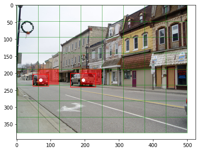
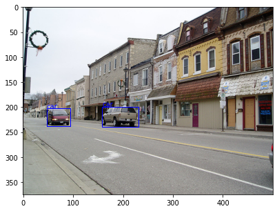
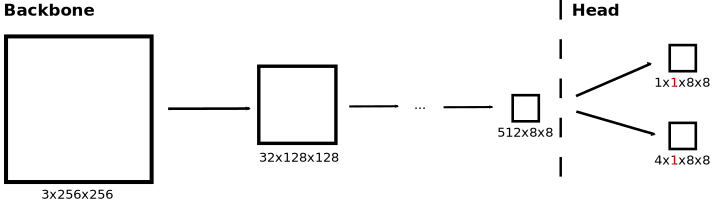
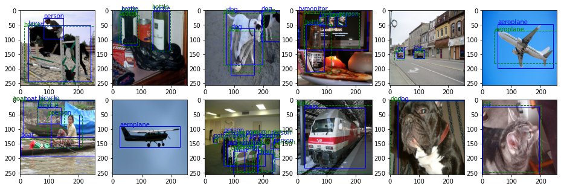
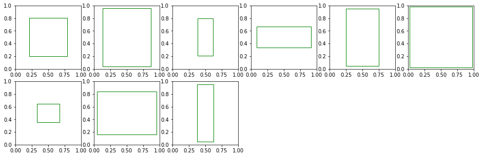

# objdetect
Light-weight and versatile one-stage object detection framework

## Introduction

I am a post-doc at FEUP (University of Porto) working on perception for autonomous vehicle ([THEIA project](https://noticias.up.pt/u-porto-bosch-projeto-de-investigacao-28-milhoes-de-euros/)). I developed this one-stage object detection framework because existing frameworks, such as [detectron2](https://github.com/facebookresearch/detectron2) are either for two-stage models or are not versatile and simple enough to adapt for new models. At the very least, I hope this package is educational for someone learning object detection.

Let me know if you have success or need help to use this package for your project. Ricardo Cruz <rpcruz@fe.up.pt>

## Install

```
pip3 install git+https://github.com/rpmcruz/objdetect.git
```

## Usage

The package is divided in the following components:

* [`datasets`](#datasets): Toy datasets. Explore them to see how to plug a new dataset.
* **`aug`**: Some data augmentation routines. You do not have to use them, you can easily use albumentations.
* [`grid`](#grid): Bounding box <=> grid conversion functions.
* [`models`](#models): Examples of models. You may use your own backbones or heads, as long as it follows the same interface.
* [`loop`](#loop): Convenience functions to train and evaluate the model.
* [`post`](#post): Post-processing algorithms; for now, non-maximum suppression.
* [`metrics`](#metrics): Common metrics.
* [`anchors`](#anchors): Utility function to find the best anchors cluster.

Each component is described below. But we also recommend that you have a look at the code itself for the full API.

### datasets

Each dataset must return a single "datum", which is a dictionary containing at least `image` and `bboxes`. Optionally, it can also contain `classes` and other attributes (such as `cos_angle` and `sin_angle` for Pixor). In this package, we heavily rely on dictionaries to bind the data inputs, the model outputs and the loss functions.

Each bounding box uses the format `(xmin, ymin, xmax, ymax)` with each value normalized [0,1].

```python
import objdetect as od
download = False
tr = od.datasets.VOCDetection('data', 'train', download, None, None)
labels = od.datasets.VOCDetection.labels
datum = tr[4]
print(datum.keys())
```

```
dict_keys(['image', 'bboxes', 'classes'])
```

Plot the datum to see if everything looks good:

```python
import matplotlib.pyplot as plt
plt.imshow(datum['image'])
od.plot.bboxes_with_classes(datum['image'], datum['bboxes'], datum['classes'], labels)
plt.show()
```


### grid

In one-shot detection, the model receives the bounding boxes in the form of a grid. We provide routines to do this transformation and its inverse. Here we are going for a 8x8 grid and we are not going to use anchors. Please see example_train.py on how to use anchors. The shape of our grids are: `(N, Nf, Na, H, W)`, where `Nf` are the features of the grid (for example, 4 for the bounding box) and `Na` the number of anchors (for consistency, even if no anchors are used, this value is 1).

```python
grid_transform = od.grid.ToGridTransform((8, 8), None)
datum = grid_transform(datum)
print(datum.keys())
```

```
dict_keys(['image', 'confs_grid', 'bboxes_grid', 'classes_grid'])
```

We recommend applying grid transformations in the Dataset class itself. We provide some data augmentation routines, but you can use albumentations (like in our `exampe_train.py`) or any other package.

```python
transform = od.aug.Resize((256, 256))
tr = od.datasets.VOCDetection('data', 'train', download, transform, grid_transform)
```

Just for illustration purposes we have a debug function to plot the grid directly (if no anchors are used, otherwise it shows only the objects for the first anchor):

```python
plt.imshow(datum['image'])
od.plot.grid_without_anchors(datum['image'], datum['confs_grid'], datum['bboxes_grid'])
plt.show()
```



The grid transformation is used for training and then you invert the grid back before plotting or applying metrics. (Notice that the inversion function receives images in batch format since it is typically used on the network outputs, and returns a list with each datum.)

```python
inv_grid_transform = od.grid.BatchFromGridTransform(None)
batch = {k: v[None] for k, v in datum.items()}
inv_datum = inv_grid_transform(batch)[0]

plt.imshow(datum['image'])
od.plot.bboxes_with_classes(datum['image'], inv_datum['bboxes'], inv_datum['classes'], labels, 'blue')
plt.show()
```



### models

To build the model we recommend defining the backbone and head separately. The head must output keys that match those from the grid transform (`confs_grid`, `bboxes_grid`, and possibly others, such as `classes_grid`).

We provide simple models that you may use, but you should consider using a pre-trained backbone from torchvision.

```python
backbone = od.models.Backbone((256, 256, 3), (8, 8))
head = od.models.HeadWithClasses(backbone.n_outputs, 1, len(labels))
model = od.models.Model(backbone, head).cuda()
```



The values in <span style="color:red">red</span> are the anchors (more about that below). In this case, we are not going to use anchors, so they are 1.

### loop

We provide convenience functions for training. Losses must be a dictionary with the same keys as the previous ones.

```python
from torch.utils.data import DataLoader
from torch import nn
import torch

transform = od.aug.Combine(
    od.aug.Resize((282, 282)), od.aug.RandomCrop((256, 256)),
    od.aug.RandomHflip(), od.aug.RandomBrightnessContrast()
)
tr = od.datasets.VOCDetection('data', 'train', download, transform, grid_transform)

tr = DataLoader(tr, 128, True, num_workers=2)
opt = torch.optim.Adam(model.parameters())
losses = {
    'confs_grid': nn.BCEWithLogitsLoss(reduction='none'),
    'bboxes_grid': nn.MSELoss(reduction='none'),
    'classes_grid': nn.CrossEntropyLoss(reduction='none'),
}
od.loop.train(model, tr, opt, losses, 100)
torch.save(model, 'model.pth')
```

For better results, you may need to train for much longer epochs and possibly use a [focal loss](https://pytorch.org/vision/stable/_modules/torchvision/ops/focal_loss.html) (like in RetinaNet) to cope with the natural object imbalance.

After the model has been trained, we can predict the objects:

```python
transform = od.aug.Resize((282, 282))
ts = od.datasets.VOCDetection('data', 'val', download, transform, grid_transform)
ts = DataLoader(ts, 128, num_workers=2)

inv_grid_transform = od.grid.BatchFromGridTransform(None, 0.1)
inputs, preds = od.loop.evaluate(model, ts, inv_grid_transform)

import matplotlib.pyplot as plt
for i in range(12):
    plt.subplot(2, 6, i+1)
    plt.imshow(inputs[i]['image'])
    od.plot.bboxes_with_classes(inputs[i]['image'], inputs[i]['bboxes'], inputs[i]['classes'], labels, 'blue')
    od.plot.bboxes_with_classes(inputs[i]['image'], preds[i]['bboxes'], preds[i]['classes'], labels, 'green', '--')
plt.show()
```



### post

As commonly done, you may use a post-processing algorithm, such as Non-Maximum Suppression (NMS), to reduce the number of false bounding boxes.

```python
for pred in preds:
    pred['bboxes'], pred['classes'] = od.post.NMS(pred['confs'], pred['bboxes'], pred['classes'])
```

```python
import matplotlib.pyplot as plt
for i in range(12):
    plt.subplot(2, 6, i+1)
    plt.imshow(inputs[i]['image'])
    od.plot.bboxes_with_classes(inputs[i]['image'], inputs[i]['bboxes'], inputs[i]['classes'], labels, 'blue')
    od.plot.bboxes_with_classes(inputs[i]['image'], preds[i]['bboxes'], preds[i]['classes'], labels, 'green', '--')
plt.show()
```


### metrics

Our framework also has common the common AP metric based on precision-recall, but it is not well tested.

```python
precision, recall = od.metrics.precision_recall_curve(preds['confs'], inputs['bboxes'], preds['bboxes'], 0.5)
plt.plot(precision, recall)
plt.show()
```

FIGURE TO DO

```python
print('AP:', od.metrics.AP(preds['confs'], inputs['bboxes'], preds['bboxes'], 0.5))
```

```
TO DO
```

### anchors

The framework also supports anchors. To compute the anchors, you may use our utility which uses KMeans. For example, if you want to find the best 9 anchors:

```python
tr = od.datasets.VOCDetection('data', 'train', False, None, None)
```

For debugging purposes, we can plot them:

```python
anchors = od.anchors.compute_clusters(tr, 9)
od.plot.anchors(anchors)
plt.show()
```


