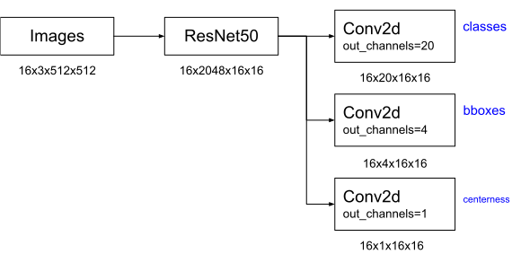

# objdetect
Lightweight and versatile one-stage object detection toolkit.

## Introduction

I am a post-doc at FEUP (University of Porto) working on perception for autonomous driving ([THEIA project](https://noticias.up.pt/u-porto-bosch-projeto-de-investigacao-28-milhoes-de-euros/)). I developed this one-stage object detection toolkit because existing frameworks, such as [detectron2](https://github.com/facebookresearch/detectron2), are either for two-stage models or are not versatile and simple enough to adapt for new models. At the very least, I hope this package is educational for someone learning object detection. Contact: [Ricardo Cruz](mailto:rpcruz@fe.up.pt).

Functionality:
* Grid and feature transformations.
* Support for anchors and multiple grids.
* Utilities such as non-maximum suppression, plotting, evaluation metrics.

## Install

```
pip3 install git+https://github.com/rpmcruz/objdetect.git
```

## API

The package is divided into the following components:

* [`anchors`](http://htmlpreview.github.io/?https://github.com/rpmcruz/objdetect/blob/main/html/anchors.html): Utilities to create and filter objects based on anchors.
* [`draw`](http://htmlpreview.github.io/?https://github.com/rpmcruz/objdetect/blob/main/html/draw.html): Simple primitives to draw the bounding boxes.
* [`grid`](http://htmlpreview.github.io/?https://github.com/rpmcruz/objdetect/blob/main/html/grid.html): One-shot object detection require utilities to transform the input onto a grid to compare against the neural network output which also produces a grid.
* [`metrics`](http://htmlpreview.github.io/?https://github.com/rpmcruz/objdetect/blob/main/html/metrics.html): Implementation of Precision-Recall and AP metrics. This module is not yet fully tested, we recommend using torchmetrics.
* [`post`](http://htmlpreview.github.io/?https://github.com/rpmcruz/objdetect/blob/main/html/post.html): Post-processing techniques to reduce the amount of superfluous bounding boxes, namely non-maximum suppression.
* [`transforms`](http://htmlpreview.github.io/?https://github.com/rpmcruz/objdetect/blob/main/html/transforms.html): Converts lists or grids into a different space more appropriate to the task.
* [`utils`](http://htmlpreview.github.io/?https://github.com/rpmcruz/objdetect/blob/main/html/utils.html): Miscelaneous utilities for data handling.

## Getting Started

A [notebook example](https://github.com/rpmcruz/objdetect/blob/main/src/example.ipynb) is provided in the `src` folder which provides boiler-plate code to get you started. The notebook is mainly inspired by [FCOS](https://arxiv.org/abs/1904.01355). Following the PyTorch tradition, this package does not try to do too much behind the scenes.

```python
import objdetect as od
```

**Data:** For augmentation and data loading, we recommend using existing packages. [Albumentations](https://albumentations.ai/) provides data augmentation methods for object detection. TorchVision provides [dataset code](https://pytorch.org/vision/stable/datasets.html#image-detection-or-segmentation) for some popular object detection datasets. See the notebook for an example.

You may any format you wish for the bounding boxes. In the notebook, we use absolute x1y1x2y2 like pascalvoc. If you use 0-1 normalization (albumentations format) then you should specify `img_size=(1,1)` to the functions that require it.

Since the number of bounding boxes varies for each image, the normal PyTorch code that converts data into batches does not work. We need to specify a `collate` function for how the batches should be created.

```python
tr = torch.utils.data.DataLoader(ds, 16, True, collate_fn=od.utils.collate_fn)
```

**Grid:** One-stage detection consists in predicting objects along a grid (or multiple grids). For that, we need to project the ground-truth in a grid. That can be done during the data augmentation pipeline (which takes advantage of the DataLoader parallelization), but it might be simpler to do so inside the training loop (as done below in the `Grid` class).

The neural network convolutions already lay the predictions are in the form of a grid, therefore there are two possibilities: (1) also lay the ground-truth in the form of a grid, or (2) convert the predictions back to a list. We are going for option (2); however, even in such a case, we need to slice the objects in such a way as to be consist with such a grid. This slicing varies between models. Models like [YOLOv3](https://arxiv.org/abs/1804.02767) use a grid where each object occupies a single location (the center). Other models such as [FCOS](https://arxiv.org/abs/1904.01355) place each object on all locations as long as the center is contained. For that reason, we have slicing functions that convert the original bounding box onto grid-coordinates of where the object is contained.

Important functions we provide:

* `od.grid.where()` returns both a boolean `mask` in the form of a grid, and a list of `indices` with the object for each one of the locations where the mask is true. These results can then be used with:
* `od.grid.mask_select()` converts a grid to a list of objects.
* `od.grid.indices_select()` converts a list of objects to another list where the objects are positioned in the same place as the respective mask. (For example, in FCOS, an object may be in multiple locations.)
* `od.grid.to_grid()` converts a list of objects to a grid. This can be useful if you want to go with possibility (1) or it might be useful since some transformations require the data to be in the form of a grid.

**Transforms:** Such as slicing varies according to the model, so do the features required by the model. Some transformation routines are provided to convert grids and compute things such as offsets (YOLOv3), relative coordinates and centerness (FCOS), etc. Some of these transformations work only with grids, while others accept both grids and lists of objects.

**Model:** We use the PyTorch philosophy of having the training loop done by the programmer. Here we provide some boiler-plate code of how to do so. We will create the model in the following picture.



The model is inspired by [FCOS](https://arxiv.org/abs/1904.01355), but without multi-grid support. However, we separate the `Grid` and `Model` classes to make it intuitive for you to add multiple grids if you wish to do so. (In such a case, you may use `od.utils.filter_grid()` to filter the bounding boxes associated to each grid.)

Notice that unlike the object detection models bundled with torchvision (e.g. [FCOS](https://pytorch.org/vision/stable/models/generated/torchvision.models.detection.fcos_resnet50_fpn.html#torchvision.models.detection.fcos_resnet50_fpn)), the behavior of this boiler-plate code does **not** changes if in `train` or `eval` mode because we prefer [Python principle](https://peps.python.org/pep-0020/) "explicit is better than implicit". We recommend using an extra `post_process()` function in your model for that. But feel free to change that.

```python
bboxes_loss = torchvision.ops.generalized_box_iou_loss
centerness_loss = torch.nn.BCEWithLogitsLoss()
labels_loss = torchvision.ops.sigmoid_focal_loss

class Grid(torch.nn.Module):
    def __init__(self, in_channels, nclasses, img_size):
        super().__init__()
        self.img_size = img_size
        # like FCOS, we do not have a dedicated 'scores' prediction. it's just
        # the argmax of the classes.
        self.classes = torch.nn.Conv2d(in_channels, nclasses, 1)
        self.bboxes = torch.nn.Conv2d(in_channels, 4, 1)
        self.centerness = torch.nn.Conv2d(in_channels, 1, 1)

    def forward(self, x):
        # like FCOS, the network is predicting bboxes in relative terms, we need
        # to convert to absolute bboxes because the loss requires so.
        bboxes = torch.exp(self.bboxes(x))
        bboxes = od.transforms.rel_bboxes(bboxes, self.img_size)
        return {'labels': self.classes(x), 'bboxes': bboxes,
            'centerness': self.centerness(x)}

    def post_process(self, preds, threshold=0.05):
        scores, labels = torch.sigmoid(preds['labels']).max(1, keepdim=True)
        bboxes = preds['bboxes']
        centerness = torch.sigmoid(preds['centerness'])
        mask = scores[:, 0] >= threshold
        # like FCOS, centerness will help NMS choose the best bbox.
        scores = scores * centerness
        return {
            'scores': od.grid.mask_select(mask, scores, True),
            'bboxes': od.grid.mask_select(mask, bboxes, True),
            'labels': od.grid.mask_select(mask, labels, True),
        }

    def compute_loss(self, preds, targets):
        grid_size = preds['bboxes'].shape[2:]
        mask, indices = od.grid.where(od.grid.slice_all_center, targets['bboxes'], grid_size, self.img_size)
        # preds grid -> list
        pred_bboxes = od.grid.mask_select(mask, preds['bboxes'])
        pred_labels = od.grid.mask_select(mask, preds['labels'])
        pred_centerness = od.grid.mask_select(mask, preds['centerness'])
        # targets list -> list
        target_bboxes = od.grid.indices_select(indices, targets['bboxes'])
        target_labels = od.grid.indices_select(indices, targets['labels'])
        # labels: must be one-hot since we use independent classifiers
        target_labels = torch.nn.functional.one_hot(target_labels.long(),
            preds['labels'].shape[1]).float()
        # compute centerness: requires doing the transformation in grid-space
        target_bboxes_grid = od.grid.to_grid(mask, indices, targets['bboxes'])
        target_rel_bboxes = od.transforms.rel_bboxes(target_bboxes_grid, self.img_size)
        target_centerness = od.transforms.centerness(target_rel_bboxes)
        target_centerness = od.grid.mask_select(mask, target_centerness)
        # compute losses
        return bboxes_loss(pred_bboxes, target_bboxes).mean() + \
            labels_loss(pred_labels, target_labels).mean() + \
            centerness_loss(pred_centerness, target_centerness)

class Model(torch.nn.Module):
    def __init__(self, nclasses, img_size):
        super().__init__()
        resnet = torchvision.models.resnet50(weights='DEFAULT')
        self.backbone = torch.nn.Sequential(*list(resnet.children())[:-2])
        self.grid = Grid(2048, nclasses, img_size)

    def forward(self, x):
        x = self.backbone(x)
        return self.grid(x)

    def post_process(self, x):
        return self.grid.post_process(x)

    def compute_loss(self, preds, targets):
        return self.grid.compute_loss(preds, targets)
```

**Losses:** We currently do not deploy any losses since they are currently implemented in [torchvision](https://pytorch.org/vision/stable/ops.html#losses). We recommend using those losses. Notice that those losses receive the inputs in the format (N,4), not as a grid; that's why in the `Grid` code, we use `od.grid.select()` to convert the grid back to lists.

**Training:** Again, here is some boiler-plate code for creating your own training loop.

```python
model.train()
for epoch in range(args.epochs):
    tic = time()
    avg_loss = 0
    for images, targets in tr:
        targets['bboxes'] = [bb.float() for bb in targets['bboxes']]
        targets = {k: [v.to(device) for v in l] for k, l in targets.items()}
        preds = model(images.to(device))
        loss_value = model.compute_loss(preds, targets)
        opt.zero_grad()
        loss_value.backward()
        opt.step()
        avg_loss += float(loss_value) / len(tr)
    toc = time()
    print(f'Epoch {epoch+1}/{args.epochs} - {toc-tic:.0f}s - Avg loss: {avg_loss}')
```

**Evaluation:** For evaluation purposes, we provide several metrics: the precision-recall curve, AP, mAP. These are mainly provided for educational purposes. We recommend that you use [TorchMetrics](https://torchmetrics.readthedocs.io/) for evaluation purposes.

For evaluation, you just need to do:

```python
model.eval()
preds = model(images.to(device))
preds = model.post_process(preds)
preds = od.post.NMS(preds)
```

## Citation

```bib
@misc{objdetect,
  author = {Ricardo Cruz},
  title = {{ObjDetect package}},
  howpublished = {\url{https://github.com/rpmcruz/objdetect}},
  year = {2022}
}
```
